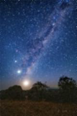

# Astro Pop
***Create pop collage with NASA's images***

[Built With](#built-with) · [Features](#features) · [Installation](#installation) · [Usage](#usage)

## Built With
- 

## Features

### Generate randomly selected collage of edited images
I implemented all my image filters into one grater collage.


### Fetching with NASA's Astronomy Picture of the Day API
The program sends a request to NASA's servers according to the user's input.
```
Start date YYYY-MM-DD: 2019-02-04
End date YYYY-MM-DD: 2019-08-15
Query: earth sky
```

### Image filters
Hard programmed image filters including...

#### Grayscale


#### Sepia


#### Blur


#### Colour filter


#### Invert


#### Greenscreen


## Installation

1. Install [Python](https://www.python.org/downloads/)

2. Clone repository
    ```sh
    git clone https://github.com/tadahiroueta/astro-pop.git
    ```
    
3. Install dependencies
    ```sh
    pip install -r requirements.txt
    ```
    > Feel free to make your own virtual environment if you want

## Usage
1. Run the program
    ```sh
    python art.py
    ```

2. Enter dates for the API request, e.g.:
    ```
    Start date YYYY-MM-DD: 2019-02-04
    End date YYYY-MM-DD: 2019-08-15
    Query: earth sky
    ```